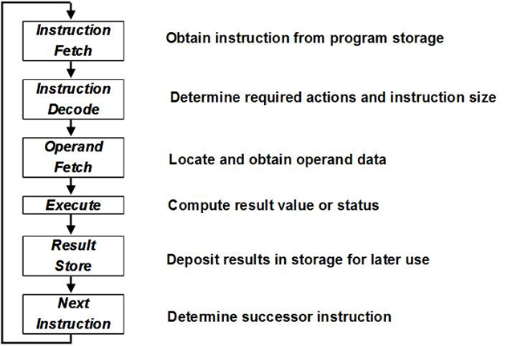

## 16bit

- The instruction set architecture (ISA) consists of 64 possible instructions

  - Part 1

  - –Memory Address Register (MAR)

    –Memory Buffer Register (MBR)

    –Program Counter (PC)

    –4 GPRs (given)

    –Instruction Register (IR)

    –Register Select Register (RSR)

    –Instruction Operation Register (Opcode)

- **Central Processor**

  - 
  - 

- **Simple Memory**

  - Mostly an array

- **Simple Cache**

  - not found

- **User Interface**

  - 
  - Additional note. The simulator example above numbers the bits increasing from right to left to reflect the numerical significance of the bits. Note that the project description shows bit positions increasing left to right. 

- **Test Programs**

  - This program will be short but show all addressing modes for the load and store instructions, allowing single step through. The program.  Memory contents at the address given in the MAR should be on the user console. 

  # API

- err = LD("target","value")

- err = store()

- err = load() -> getAll()

- err = init() -> getAll()

- err = run() -> getAll()

- err = singleStep() -> getAll()

- map,err = getAll()

  - {"target","value"}

# basic structure

run

for {

singleStep

}

singlestep{

分析当前该干啥

switch:

end

}

# TODO

singlestep具体含义？-> 若佳

Binary python最好的表现方式？ ->冠宇

确定circle具体形式 -> 若佳

前端架子 -> Alan，zhengyi

# Part1

- enter data into any of R0 – R3 and IX1-IX3
- enter data into memory via switches
- enter the various Load and Store instructions instructions into memory
- enter address into PC and press Single Step switch to execute the instruction at that address
